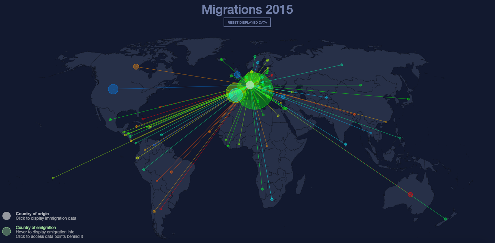
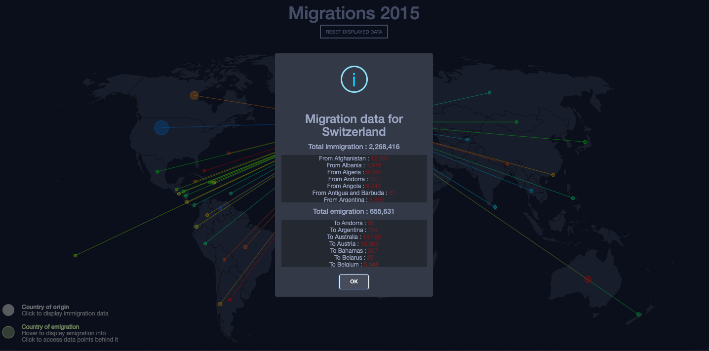

# 2015 migration data visualisation
### A simple d3 document that uses the U.N.'s 2015 migration data and displays is visually on a geoJSON world map.

*Main view after clicking on a country*

## The project
This d3 document was developped in the context of Isaac Pante's and Loïc Cattani's "Visualisation de données" class at the University of Lausanne (UNIL).
The idea was to visually display the [U.N. 2015 migration data](https://www.un.org/en/development/desa/population/migration/data/estimates2/estimates15.asp) on a world map. Each country had to be clickable and, after a click, had to display a path to the countries this country's people emigrated to. Each colored circle represents an emigration from the origin country (white circle). The colored circles' sizes vary depending on the amount of people emigrating to that country. If the origin country's circle (white circle) is clicked, a modal will display the full emigration/immigraiton data for that country. 

*Modal display of migration data*

## Dependencies
* [BootStrap](https://getbootstrap.com/)
* [D3](https://d3js.org/)
  * [D3-geo-projection v2](https://github.com/d3/d3-geo-projection)
  * [D3-path](https://github.com/d3/d3-path)
  * [D3-tip](https://github.com/caged/d3-tip)
* [JQuery](https://ajax.googleapis.com/ajax/libs/jquery/3.4.1/jquery.min.js)
* [SweetAlert2](https://sweetalert2.github.io/)

