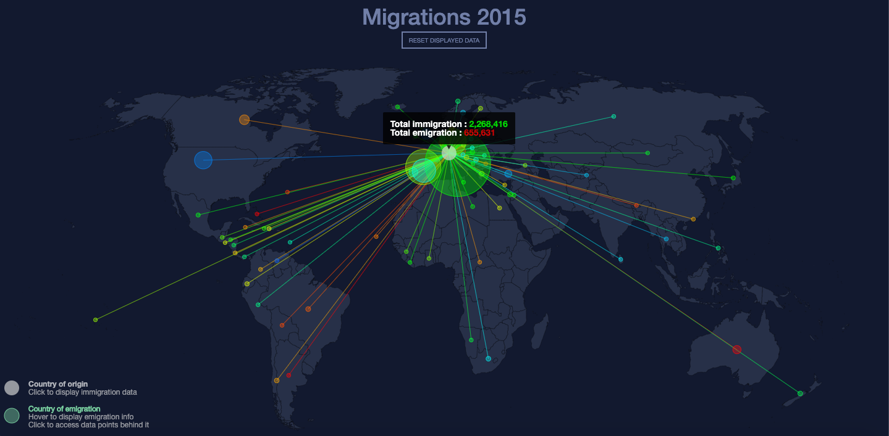
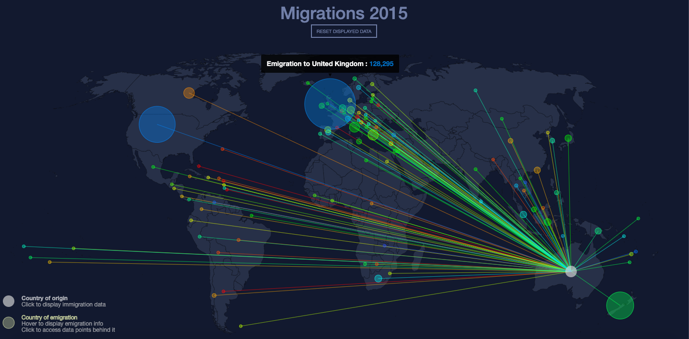

# 2015 migration data visualisation
### A simple d3 document that uses the U.N.'s 2015 migration data and displays it on a geoJSON world map.

*Main view after clicking on a country*

## The project
This d3 document was developped in the context of Isaac Pante's and Loïc Cattani's "Visualisation de données" class at the University of Lausanne (UNIL).
The idea was to visually display the [U.N. 2015 migration data](https://www.un.org/en/development/desa/population/migration/data/estimates2/estimates15.asp) on a world map. Each country had to be clickable and, after a click, had to display a path to the countries this country's people emigrated to. The clicked country is called the "origin country" and is represented by a white circle appearing at its centroid. If the origin country's circle is clicked, a modal will display the full emigration/immigraiton data for that country. 

*Modal display of migration data*

If the country of origin's circle is hovered, a tool tip will display the total immigration/emigration for that country. This makes the information much more digestable than the modal view.

From that white circle depart a number of path directed to the centroids of every country in which at least one person emigrated. A colored circle – matching the color of the path from the origin country – will be drawn at the countries of emigration's centroids. Each colored circle represents an emigration from the origin country. The colored circles' sizes vary depending on the amount of people emigrating to that country. If hovered, the colored circles will display a tool tip displaying exactly how many people emigrated to that country. 

*Tool tip displaying emigration data*

You will notice that sometimes, especially in Africa and Europe, the emigration circles tend to overlap each other, making it hard, or even impossible, to access some circles' data. However, if clicked, the colored circles will be send to the back of the other circles.

## Packages
* [BootStrap](https://getbootstrap.com/)
* [D3](https://d3js.org/)
  * [D3-geo-projection v2](https://github.com/d3/d3-geo-projection)
  * [D3-path](https://github.com/d3/d3-path)
  * [D3-tip](https://github.com/caged/d3-tip)
* [JQuery](https://ajax.googleapis.com/ajax/libs/jquery/3.4.1/jquery.min.js)
* [SweetAlert2](https://sweetalert2.github.io/)
